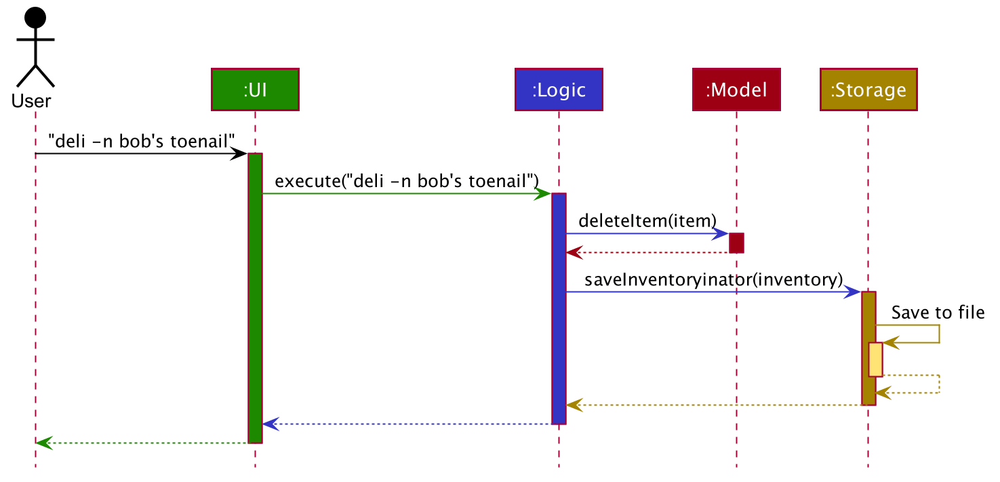
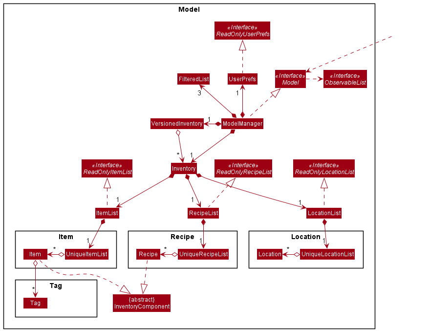
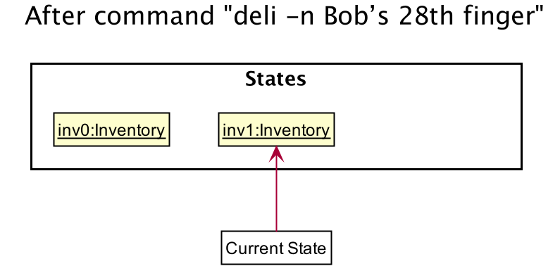
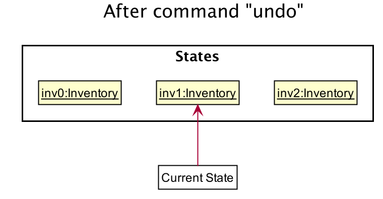
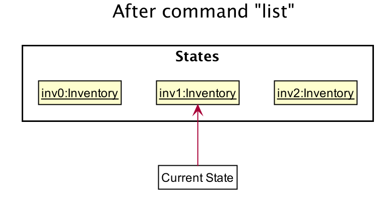
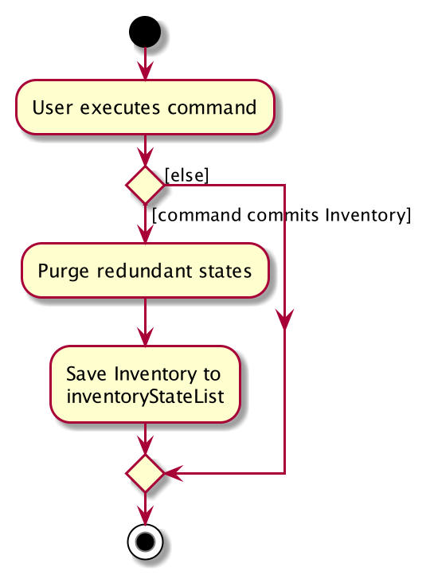

* Table of Contents
{:toc}

#Developer Guide

This is the developer guide for 

## **Documentation, logging, testing, configuration, dev-ops**

* [Documentation guide](Documentation.md)
* [Testing guide](Testing.md)
* [Logging guide](Logging.md)
* [Configuration guide](Configuration.md)
* [DevOps guide](DevOps.md)
* [EndUserPersona](EndUserPersona.md)
* [Usecases](Usecases.md)
--------------------------------------------------------------------------------------------------------------------

## **Setting up, getting started**

Refer to the guide [UserGuide](UserGuide.md).

--------------------------------------------------------------------------------------------------------------------

## **Design**

### Architecture

The ***Architecture Diagram*** given above explains the high-level design of the App. Given below is a quick overview of each component.

**`Main`** has two classes called [`Main`](https://github.com/AY2021S1-CS2103T-F13-1/tp/blob/master/src/main/java/seedu/address/Main.java) and [`MainApp`](https://github.com/se-edu/addressbook-level3/tree/master/src/main/java/seedu/address/MainApp.java). It is responsible for,
* At app launch: Initializes the components in the correct sequence, and connects them up with each other.
* At shut down: Shuts down the components and invokes cleanup methods where necessary.

[**`Commons`**](#common-classes) represents a collection of classes used by multiple other components.

The rest of the App consists of four components.

* [**`UI`**](#ui-component): The UI of the App.
* [**`Logic`**](#logic-component): The command executor.
* [**`Model`**](#model-component): Holds the data of the App in memory.
* [**`Storage`**](#storage-component): Reads data from, and writes data to, the hard disk.

Each of the four components,

* defines its *API* in an `interface` with the same name as the Component.
* exposes its functionality using a concrete `{Component Name}Manager` class (which implements the corresponding API `interface` mentioned in the previous point.

For example, the `Logic` component (see the class diagram given below) defines its API in the `Logic.java` interface and exposes its functionality using the `LogicManager.java` class which implements the `Logic` interface.

**How the architecture components interact with each other**

The *Sequence Diagram* below shows how the components interact with each other for the scenario where the user issues the command `delete 1`.

The sections below give more details of each component.

### UI component

**API** :
[`Ui.java`](https://github.com/AY2021S1-CS2103T-F13-1/tp/blob/master/src/main/java/seedu/address/ui/Ui.java)

The UI consists of a `MainWindow` that is made up of parts e.g.`CommandBox`, `ResultDisplay`, `PersonListPanel`, `StatusBarFooter` etc. All these, including the `MainWindow`, inherit from the abstract `UiPart` class.

The `UI` component uses JavaFx UI framework. The layout of these UI parts are defined in matching `.fxml` files that are in the `src/main/resources/view` folder. For example, the layout of the [`MainWindow`](https://github.com/se-edu/addressbook-level3/tree/master/src/main/java/seedu/address/ui/MainWindow.java) is specified in [`MainWindow.fxml`](https://github.com/se-edu/addressbook-level3/tree/master/src/main/resources/view/MainWindow.fxml)

The `UI` component,

* Executes user commands using the `Logic` component.
* Listens for changes to `Model` data so that the UI can be updated with the modified data.

### Logic component

**API** :
[`Logic.java`](https://github.com/AY2021S1-CS2103T-F13-1/tp/blob/master/src/main/java/seedu/address/logic/Logic.java)

1. `Logic` uses the `InventoryinatorParser` class to parse the user command.
1. This results in a `Command` object which is executed by the `LogicManager`.
1. The command execution can affect the `Model` (e.g. adding a person).
1. The result of the command execution is encapsulated as a `CommandResult` object which is passed back to the `Ui`.
1. In addition, the `CommandResult` object can also instruct the `Ui` to perform certain actions, such as displaying help to the user.

Given below is the Sequence Diagram for interactions within the `Logic` component for the `execute("del bob's toenail -r 1")` API call.

### Model component

**API** : [`Model.java`](https://github.com/AY2021S1-CS2103T-F13-1/tp/blob/master/src/main/java/seedu/address/model/Model.java)

The `Model`,

* stores a `UserPref` object that represents the user’s preferences.
* stores the Inventoryinator data
* exposes an unmodifiable `ObservableList<Item>` that can be 'observed' e.g. the UI can be bound to this list so that the UI automatically updates when the data in the list change.
* does not depend on any of the other three components.

### Storage component

**API** : [`Storage.java`](https://github.com/AY2021S1-CS2103T-F13-1/tp/blob/master/src/main/java/seedu/address/storage/Storage.java)

The `Storage` component,
* can save `UserPref` objects in json format and read it back.
* can save the inventory data in json format and read it back.
* can save recipes data in json format and read it back. 

### Common classes

Classes used by multiple components are stored in the `seedu.addressbook.commons` package.

--------------------------------------------------------------------------------------------------------------------

## **Implementation**

This section describes some noteworthy details on how certain features are implemented.

### \[Proposed\] Undo/redo feature

#### Proposed Implementation

The proposed undo/redo mechanism is facilitated by `VersionedInventoryinator`. It extends `Inventoryinator` with an undo/redo history, stored internally as an `inventoryinatorStateList` and `currentStatePointer`. Additionally, it implements the following operations:

* `VersionedInventoryinator#commit()` — Saves the current address book state in its history.
* `VersionedInventoryinator#undo()` — Restores the previous address book state from its history.
* `VersionedInventoryinator#redo()` — Restores a previously undone address book state from its history.

These operations are exposed in the `Model` interface as `Model#commitInventoryinator()`, `Model#undoInventoryinator()` and `Model#redoInventoryinator()` respectively.

Given below is an example usage scenario and how the undo/redo mechanism behaves at each step.

Step 1. The user launches the application for the first time. The `VersionedInventoryinator` will be initialized with the initial address book state, and the `currentStatePointer` pointing to that single address book state.

Step 2. The user executes `delete 5` command to delete the 5th person in the address book. The `delete` command calls `Model#commitInventoryinator()`, causing the modified state of the address book after the `del Bob’s 28th finger` command executes to be saved in the `addressBookStateList`, and the `currentStatePointer` is shifted to the newly inserted address book state.

Step 3. The user executes `addi Bob’s 6th regret -q 8` to add a new person. The `add` command also calls `Model#commitInventoryinator()`, causing another modified address book state to be saved into the `inventoryinatorStateList`.

**Note:** If a command fails its execution, it will not call `Model#commitInventoryinator()`, so the address book state will not be saved into the `inventoryinatorStateList`.

Step 4. The user now decides that adding the person was a mistake, and decides to undo that action by executing the `undo` command. The `undo` command will call `Model#undoInventoryinator()`, which will shift the `currentStatePointer` once to the left, pointing it to the previous address book state, and restores the address book to that state.

**Note:** If the `currentStatePointer` is at index 0, pointing to the initial Inventoryinator state, then there are no previous Inventoryinator states to restore. The `undo` command uses `Model#canUndoinventoryinator()` to check if this is the case. If so, it will return an error to the user rather
than attempting to perform the undo.

The following sequence diagram shows how the undo operation works:

**Note:** The lifeline for `UndoCommand` should end at the destroy marker (X) but due to a limitation of PlantUML, the lifeline reaches the end of diagram.

The `redo` command does the opposite — it calls `Model#redoInventoryinator()`, which shifts the `currentStatePointer` once to the right, pointing to the previously undone state, and restores the address book to that state.

**Note:** If the `currentStatePointer` is at index `inventoryinatorStateList.size() - 1`, pointing to the latest address book state, then there are no undone Inventoryinator states to restore. The `redo` command uses `Model#canRedoInventoryinator()` to check if this is the case. If so, it will return an error to the user rather than attempting to perform the redo.

Step 5. The user then decides to execute the command `list`. Commands that do not modify the inventory, such as `list`, will usually not call `Model#commitInventoryinator()`, `Model#undoInventoryinator()` or `Model#redoInventoryinator()`. Thus, the `inventoryinatorStateList` remains unchanged.

Step 6. The user executes `clear`, which calls `Model#commitInventoryinator()`. Since the `currentStatePointer` is not pointing at the end of the `inventoryinatorStateList`, all address book states after the `currentStatePointer` will be purged. Reason: It no longer makes sense to redo the `add n/David …​` command. This is the behavior that most modern desktop applications follow.

The following activity diagram summarizes what happens when a user executes a new command:

#### Design consideration:

##### Aspect: How undo & redo executes

* **Alternative 1 (current choice):** Saves the entire address book.
  * Pros: Easy to implement.
  * Cons: May have performance issues in terms of memory usage.

* **Alternative 2:** Individual command knows how to undo/redo by
  itself.
  * Pros: Will use less memory (e.g. for `delete`, just save the person being deleted).
  * Cons: We must ensure that the implementation of each individual command are correct.

* **Alternative 3:** Store a LinkedList of Negations of non-viewing commands.
  * Pros: Similar to **Alternative 2** but instead of an explicit undo for each command, store a size k LeakyStack of commands.
   This is easier to implement, but may be impacted by complex symantics of implementing macro commands. 
  * Cons: Harder to implement.

### \[Proposed\] Data archiving

_{Explain here how the data archiving feature will be implemented}_

--------------------------------------------------------------------------------------------------------------------

## **Appendix: Requirements**

### Product scope

**Target user profile**:

* has a need to manage a significant number of items in a game.
* prefer desktop apps over other types
* can type fast
* prefers typing to mouse interactions
* is very comfortable with using CLI apps

**Value proposition**: manage inventory faster than a typical mouse/GUI driven app

### User stories for V1.1

Priorities: High (must have) - `* * *`, Medium (nice to have) - `* *`, Low (unlikely to have) - `*`

| Priority | As a …​                                    | I want to …​                     | So that I can…​                                             |
| -------- | ------------------------------------------ | ------------------------------ | ---------------------------------------------------------------------- |
| `* * *`  | new user                                   | see usage instructions         | refer to instructions when I forget how to use the App                 |
| `* * *`  | user                                       | add a new item                 |                                                                        |
| `* * *`  | user                                       | add a recipe                   |                                                                        |
| `* * *`  | user                                       | delete a item                  | remove item that I no longer need to track                             |
| `* * *`  | user                                       | delete a recipe                | remove recepies that I no longer need to use                           |
| `* * *`  | user                                       | find a item by name            | locate details of items without having to go through the entire list   |
| `* * `   | user                                       | tag a item by location         | locate items by where they are located                                 |

*{More to be added in later iterations}*

**Extensions**

* 2a. The list is empty.

  Use case ends.

* 3a. The given index is invalid.

    * 3a1. Inventoryinator shows an error message.

      Use case resumes at step 2.

### Non-Functional Requirements

1.  Should work on any _mainstream OS_ as long as it has Java `11` or above installed.
2.  Should be able to hold up to 1000 persons without a noticeable sluggishness in performance for typical usage.
3.  A user with above average typing speed for regular English text (i.e. not code, not system admin commands)
 should be able to accomplish most of the tasks faster using commands than using the mouse.
4.  A user should be able to view visually the output from the Application
*{More to be added}*

### Glossary

* **Mainstream OS**: Windows, Linux, Unix, OS-X
* **Item**: An item represents an object you obtain in a game. Eg a Rock
* **Recipe**: An recipe is associated with multiple items, and represents the consumption of items in the input,
 to produce an item of the output.
