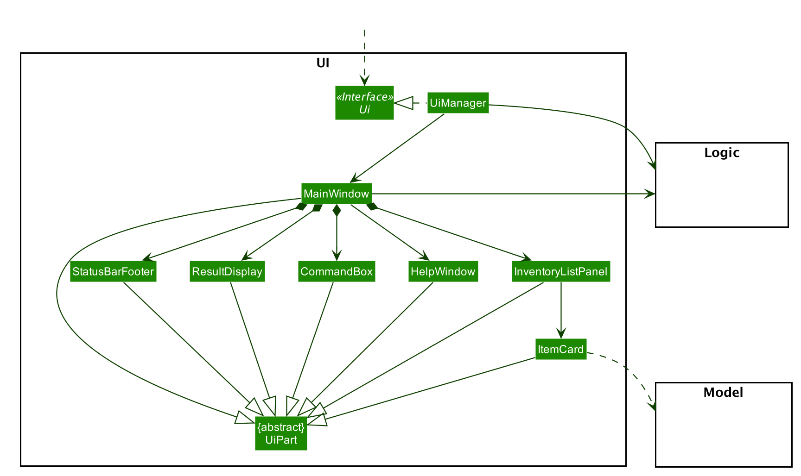
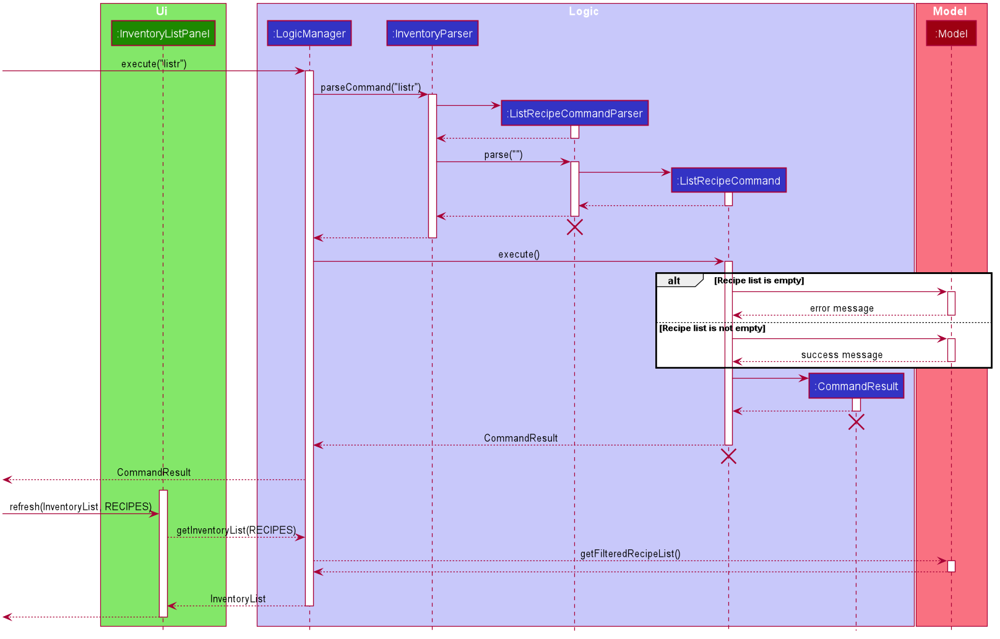
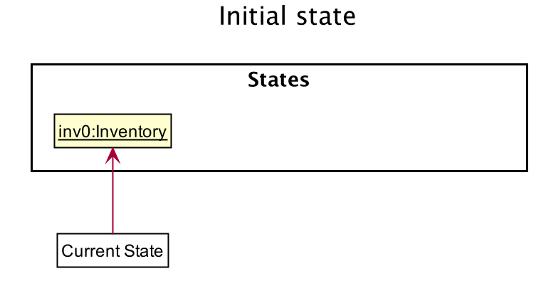
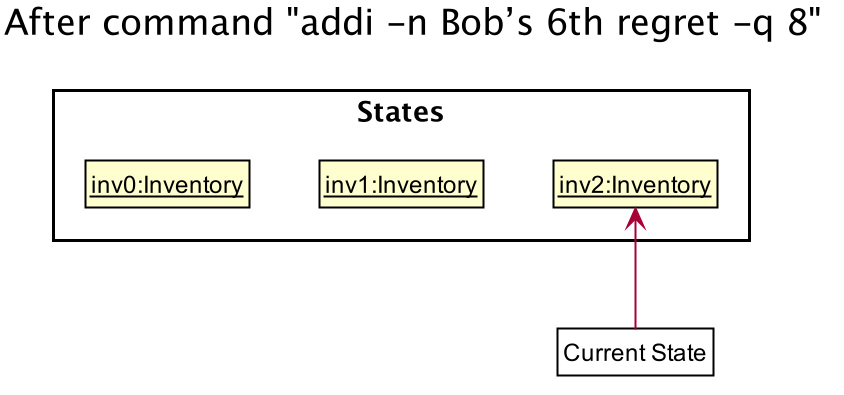
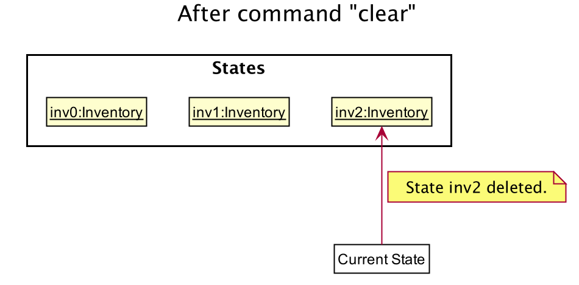

* Table of Contents
{:toc}

This is the developer guide for `Inventoryinator` a brownfield project evolved
from [AddressBook3](https://github.com/nus-cs2103-AY2021S1/tp).

Inventoryinator is a **desktop app for game inventories, optimized for use via a Command Line Interface** (CLI) 
while still having the benefits of a Graphical User Interface (GUI). If you can type fast, Inventoryinator can
get your inventory management tasks done faster than traditional GUI apps.

## **Documentation, logging, testing, configuration, dev-ops**

* [Documentation guide](Documentation.md)
* [Testing guide](Testing.md)
* [Logging guide](Logging.md)
* [Configuration guide](Configuration.md)
* [DevOps guide](DevOps.md)
* [EndUserPersona](EndUserPersona.md)
* [Usecases](Usecases.md)
* [Implementation Details and Sequence Flow](CommandSequenceDiagram.md)
--------------------------------------------------------------------------------------------------------------------

## **Setting up, getting started**

Refer to the guide [UserGuide](UserGuide.md).

--------------------------------------------------------------------------------------------------------------------

## **Design**

### Architecture

The ***Architecture Diagram*** given above explains the high-level design of the App.
Given below is a quick overview of each component.

**`Main`** has two classes called [`Main`](https://github.com/AY2021S1-CS2103T-F13-1/tp/blob/master/src/main/java/seedu/address/Main.java)
and [`MainApp`](https://github.com/se-edu/addressbook-level3/tree/master/src/main/java/seedu/address/MainApp.java).
It is responsible for:
* At app launch: Initializes the components in the correct sequence, and connects them up with each other.
* At shut down: Shuts down the components and invokes cleanup methods where necessary.

[**`Commons`**](#common-classes) represents a collection of classes used by multiple other components.

The rest of the App consists of four components.

* [**`UI`**](#ui-component): The UI of the App.
* [**`Logic`**](#logic-component): The command executor.
* [**`Model`**](#model-component): Holds the data of the App in memory.
* [**`Storage`**](#storage-component): Reads data from, and writes data to, the hard disk.

Each of the four components,

* defines its *API* in an `interface` with the same name as the Component.
* exposes its functionality using a concrete `{Component Name}Manager` class (which implements the corresponding
API `interface` mentioned in the previous point.

For example, the `Logic` component (see the class diagram given below) defines its API in the `Logic.java` interface
and exposes its functionality using the `LogicManager.java` class which implements the `Logic` interface.

**How the architecture components interact with each other**

The *Sequence Diagram* below shows how the components interact with each other
 for the scenario where the user issues the command `delr bob's toenail -r 1`.

The sections below give more details of each component.

### UI component

**API** :
[`Ui.java`](https://github.com/AY2021S1-CS2103T-F13-1/tp/blob/master/src/main/java/seedu/address/ui/Ui.java)

The UI consists of a `MainWindow` that is made up of parts e.g.`CommandBox`, `ResultDisplay`, `PersonListPanel`,
`StatusBarFooter` etc. All these, including the `MainWindow`, inherit from the abstract `UiPart` class.

The `UI` component uses JavaFx UI framework. The layout of these UI parts are defined in matching `.fxml` files that
are in the `src/main/resources/view` folder. For example, the layout of the
[`MainWindow`](https://github.com/se-edu/addressbook-level3/tree/master/src/main/java/seedu/address/ui/MainWindow.java)
is specified in [`MainWindow.fxml`](https://github.com/se-edu/addressbook-level3/tree/master/src/main/resources/view/MainWindow.fxml)

The `UI` component,

* Executes user commands using the `Logic` component.
* Listens for changes to `Model` data so that the UI can be updated with the modified data.

### Logic component

**API** :
[`Logic.java`](https://github.com/AY2021S1-CS2103T-F13-1/tp/blob/master/src/main/java/seedu/address/logic/Logic.java)

1. `Logic` uses the `InventoryinatorParser` class to parse the user command.
1. This results in a `Command` object which is executed by the `LogicManager`.
1. The command execution can affect the `Model` (e.g. adding a person).
1. The result of the command execution is encapsulated as a `CommandResult` object which is passed back to the `Ui`.
1. In addition, the `CommandResult` object can also instruct the `Ui` to perform certain actions, such as displaying help to the user.

Given below is the Sequence Diagram for interactions within the `Logic` component for the `execute("delr bob's toenail -r 1")` API call.

### Model component

**API** : [`Model.java`](https://github.com/AY2021S1-CS2103T-F13-1/tp/blob/master/src/main/java/seedu/address/model/Model.java)

The `Model`,

* stores a `UserPref` object that represents the user’s preferences.
* stores the Inventoryinator data
* exposes an unmodifiable `ObservableList<Item>` and `ObservableList<Recipe>` which can be 'observed' e.g. the UI can be bound to this list so that the UI automatically updates when the data in the list change.
* does not depend on any of the other three components.

### Storage component

**API** : [`Storage.java`](https://github.com/AY2021S1-CS2103T-F13-1/tp/blob/master/src/main/java/seedu/address/storage/Storage.java)

The `Storage` component,
* can save `UserPref` objects in json format and read it back.
* can save the inventory data in json format and read it back.
* can save recipes data in json format and read it back. 
* can save location data in json format and read it back.

### Common classes

Classes used by multiple components are stored in the `seedu.addressbook.commons` package.

--------------------------------------------------------------------------------------------------------------------

## **Implementation**

This section describes some noteworthy details on how certain features are implemented.

### Add Quantity feature

`AddQuantityToItemCommand` facilitates the addition of a user-input quantity to an existing `Item`.
This command is a specific invocation of an `EditItemCommand` that only modifies the `Item`'s quantity,
and instead of replacing the quantity by a new value in `EditItemCommand`, the user-input quantity
is added to the existing `Item`'s `Quantity`.

This added `Quantity` can be negative and this is why `int` is used in `AddQuantityToItemCommand` as
opposed to `Quantity`, which only accepts non-negative integers. However, the final `Quantity` of the
modified `Item` cannot be below 0.

`AddQuantityToItemCommand` is dependent on `EditItemCommand` and utilises it to execute its
intended behaviour. It builds a `EditItemDescriptor` by searching for the `Item`'s attributes.
Using the current `Quantity` and the user-input, it calculates an updated `Quantity`. It then
constructs and executes an `EditItemCommand` to replace the `Item`'s `Quantity` with the
updated value.

The sequence diagram for the execution of an `AddQuantityToItemCommand` is as follows:

The `Item` with name banana is denoted as `itemBanana`, and the original quantity assumed to be `20`.

### List item/recipe feature

The list item/recipe feature allows the user to toggle between viewing the list of all items or recipes in the 
current inventory. 

#### Implementation

There are three main view modes available: the existing item list, existing recipe list, and detailed item view.

In `InventoryMainWindow`, whenever a command is executed, the `InventoryListPanel` is refreshed, to be filled with the relevant inventory list.
This list is retrieved by `getInventoryList` in `LogicManager`, based on the current view mode.

For list item, list recipe and view details commands, the relevant display mode is stored in the `CommandResult`. 
Upon execution, `InventoryMainWindow` will store the display mode, and pass on to the `InventoryListPanel` and `LogicManager`.

For all other commands, they return a `CommandResult` with `UNCHANGED` as the inventory type. 
This indicates that the view mode should not be changed. The same type of inventory list (updated accordingly)
will be retrieved and displayed.

Given below is an example usage of list item and list recipes and what is displayed at each step.

Step 1: The user launches the application. By default, the item list is displayed.

Step 2: The user executes `listr` to view the recipe list. The current recipe list is now displayed.

Step 3: The user executes `addi -n Bob’s 6th regret -q 8` to add a new item. The recipe list is still displayed.

Step 4: The user executes `view Bob's 6th regret` to view the details of the item. 
The detailed item is now displayed, and all other items are removed from view.

Step 5: The user executes `listi` to view the item list. The current item list is now displayed.

The following sequence diagram shows how the list items operation works:

The following sequence diagram shows how the list recipes operation works:

### \[Proposed\] Undo/redo feature

#### Proposed Implementation

`VersionedInventory` facilitates the proposed undo/redo feature. It extends `Inventory`, with
comprises: `ItemList`, `LocationList` and `RecipeList` and contains the entire `Inventory`'s undo/redo history,
stored internally as an `inventoryStateList` and `currentStatePointer`.

Additionally, it implements the following operations:

* `VersionedInventory#commit()` — Saves the current inventory state in its history.
* `VersionedInventory#undo()` — Restores the previous inventory state from its history.
* `VersionedInventory#redo()` — Restores a previously undone inventory state from its history.

These operations are exposed in the `Model` interface as `Model#commitInventory()`, `Model#undoInventory()` and
`Model#redoInventory()` respectively.

Given below is an example usage scenario and how the undo/redo mechanism behaves at each step.

Step 1. The user launches the application for the first time. The `VersionedInventory` will be initialized with
the initial inventory state, and the `currentStatePointer` pointing to that single inventory state.

Step 2. The user executes `deli Bob’s 28th finger` (a `DeleteItemCommand`) command to delete the matching item in
the inventory. The `deli` command calls `Model#commitInventory()`, causing the modified state of the inventory
after the `deli Bob’s 28th finger` command executes to be saved in the `inventoryStateList`, and the
`currentStatePointer` is shifted to the newly inserted inventory state.

Step 3. The user executes `addi Bob’s 6th regret -q 8` (a `AddItemCommand`) to add a new item.
The `addi` command also calls `Model#commitInventory()`, causing another modified inventory state to be
saved into the `inventoryStateList`.

**Note:** If a command fails its execution, it will not call `Model#commitInventory()`, so the inventory
state will not be saved into the `inventoryStateList`.

Step 4. The user now decides that adding the item was a mistake, and decides to undo that action by executing the
`undo` command. The `undo` command will call `Model#undoInventory()`, which will shift the `currentStatePointer`
once to the left, pointing it to the previous inventory state, and restores the inventory to that state.

**Note:** If the `currentStatePointer` is at index 0, pointing to the initial `Inventory` state, then there are 
no previous `Inventory` states to restore. The `undo` command uses `Model#canUndoinventory()` to check if this
is the case. If so, it will return an error to the user rather than attempting to perform the undo.

The following sequence diagram shows how the undo operation works:

**Note:** The lifeline for `UndoCommand` should end at the destroy marker (X) but due to a
limitation of PlantUML, the lifeline reaches the end of diagram.

The `redo` command does the opposite — it calls `Model#redoInventory()`, which shifts the `currentStatePointer`
once to the right, pointing to the previously undone state, and restores the inventory to that state.

**Note:** If the `currentStatePointer` is at index `inventoryStateList.size() - 1`, pointing to the
latest inventory state, then there are no undone `Inventory` states to restore. The `redo` command uses
`Model#canRedoInventory()` to check if this is the case. If so, it will return an error to the user
rather than attempting to perform the redo.

Step 5. The user then decides to execute the command `listi`. Commands that do not modify the inventory, such as 
`listi`, will usually not call `Model#commitInventory()`, `Model#undoInventory()` or `Model#redoInventory()`.
Thus, the `inventoryinatorStateList` remains unchanged.

Step 6. The user executes `clear`, which calls `Model#commitInventory()`. Since the `currentStatePointer`
is not pointing at the end of the `inventoryStateList`, all inventory states after the `currentStatePointer`
will be purged. Reason: It no longer makes sense to redo the `addi Bob’s 6th regret -q 8` command. This is the
behavior that most modern desktop applications follow.

The following activity diagram summarizes what happens when a user executes a new command:

#### Design consideration:

##### Aspect: How undo & redo executes

* **Alternative 1 (current choice):** Saves the entire inventory.
  * Pros: Easy to implement.
  * Cons: May have performance issues in terms of memory usage.

* **Alternative 2:** Store a stack of commands that have been run.
  * Pros: We store a stack of commands which is added to whenever the user runs a new command that
          modifies the inventory state. When undo is invoked, the stack is popped and added to a
          redo stack, and the command will be negated and run. When redo is invoked, the redo stack
          is popped and the command is run.
  * Cons: Harder to implement as each command has to be negated individually. This has considerably
          many edge cases to consider.

--------------------------------------------------------------------------------------------------------------------

## **Appendix: Requirements**

### Product scope

**Target user profile**:

* has a need to manage a significant number of items in a game.
* prefer desktop apps over other types
* can type fast
* prefers typing to mouse interactions
* is very comfortable with using CLI apps

**Value proposition**: manage inventory faster than a typical mouse/GUI driven app

### User stories for V1.1

Priorities: High (must have) - `* * *`, Medium (nice to have) - `* *`, Low (unlikely to have) - `*`

| Priority | As a …​                                    | I want to …​                     | So that I can…​                                             |
| -------- | ------------------------------------------ | ------------------------------ | ---------------------------------------------------------------------- |
| `* * *`  | new user                                   | see usage instructions         | refer to instructions when I forget how to use the App                 |
| `* * *`  | user                                       | add a new item                 |                                                                        |
| `* * *`  | user                                       | add a recipe                   |                                                                        |
| `* * *`  | user                                       | delete a item                  | remove item that I no longer need to track                             |
| `* * *`  | user                                       | delete a recipe                | remove recepies that I no longer need to use                           |
| `* * *`  | user                                       | find a item by name            | locate details of items without having to go through the entire list   |
| `* * `   | user                                       | tag a item by location         | locate items by where they are located                                 |
| `* * `   | user                                       | use del command to delete both recipes and items         | improve user experience in the application   |
*{More to be added in later iterations}*

### Non-Functional Requirements

1.  Should work on any _mainstream OS_ as long as it has Java `11` or above installed.
2.  Should be able to hold up to 1000 persons without a noticeable sluggishness in performance for typical usage.
3.  A user with above average typing speed for regular English text (i.e. not code, not system admin commands)
 should be able to accomplish most of the tasks faster using commands than using the mouse.
4.  A user should be able to view visually the output from the Application
*{More to be added}*

### Glossary

* **Mainstream OS**: Windows, Linux, Unix, OS-X
* **Item**: An item represents an object you obtain in a game. Eg a <u>Rock</u>
* **Recipe**: An recipe is associated with multiple items, and represents the consumption of items in the input,
 to produce an item of the output. Eg: a 3 <u>Sticks</u> -> <u>Staff</u>
* **Location**: The place where a Item can be found in game. Eg: <u>Sleepywood</u>
* **Inventory**: The entire state of the inventoryinator, including recipes, items and item quantities.
