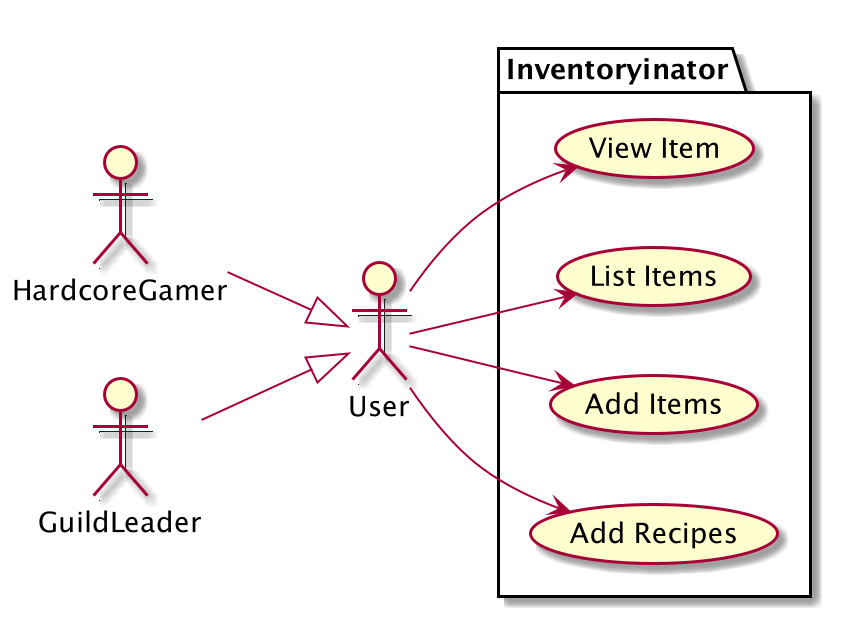

* Table of Contents
{:toc}

# Usecase Documentation
This document will store the usecases and workflow usecases in our designed product `Inventoryinator`.

### Feature Usecases

#### Usecase 1 Create Item
- Software System: Inventoryinator (`inv`)
- Use Case UC1 - Create Item
- Precondition: Inventoryinator is running
- Actor: User
- MSS:
    1. User enters in input to create an item
    2. `inv` validates a correct input
    3. `inv` registers the parsed input as a new item
    4. `inv` displays successful message of creation of an item

**Extension:**  
2a. `inv` detects a error in given input 
2a1. `inv` returns a `CommandUnsuccessful` message to user
2a2. User inputs new data
Steps 2a1-2a2 repeat until data is correct, or user enters a different command.

3b. `inv` detects item already exists 
3b1. `inv` adds quantity of item from command into registered item.
4b. `inv` displays that item quantity is updated.

#### Usecase 2 View Item

- Software System: Inventoryinator (`inv`)
- Use Case UC2 - View Item
- Precondition: Inventoryinator is running
- Actor: User
- MSS:
    1. User enters in input to view an item
    2. `inv` validates that given input conforms to command format
    3. `inv` displays the Successful command

**Extensions:**

2a. `inv` detects a error in given input 
2a1. `inv` returns a `CommandUnsuccessful` message to user 
2a2. User inputs new data 
Steps 2a1-2a2 repeat until data is correct, or user enters a different command 
Usecase ends.

#### Usecase 3 Create Recipe
- Software System: Inventoryinator (`inv`)
- Use Case UC3 - Create Recipe
- Precondition: Inventoryinator is running
- Actor: User
- MSS:
    1. User enters in input to create an recipe for an item
    2. `inv` validates the user inputs and parses the fields given
    3. `inv` creates and registers the recepie for an item
    4. `inv` displays successful message of creation of an recipe
**Extension:** 
2a. `inv` detects a error in given input
2a1. `inv` returns a `CommandUnsuccessful` message to user
2a2. User inputs new data
Steps 2a1-2a2 repeat until data is correct, or user enters a different command.

2b. `inv` detects that the item being crafted does not exist as of yet
2b1. `inv` creates a new item with the appropriate fields, or if not, the default fields
Usecase resumes from step 3 normally

#### Usecase 4 List items
- Software System: Inventoryinator (`inv`)
- Use Case UC4 - List items
- Precondition: Inventoryinator is running
- Actor: User
- MSS:
    1. User enters command to list all items
    2. `inv` parses command
    3. `inv` returns the contents registered

**Extension:**

3a. `inv` does not contain any items 
3a1. Returns a empty List of items 
Usecase end

### Workflow Usecases

#### Workflow Usecase 1
- Software System: Inventoryinator (`inv`)
- Use Case WU1 - Querying and validating uniqueness of items
- Precondition: Inventoryinator is running, a and b are registered in system already 
- Actor: Hardcore Gamer
- MSS:
    1. User adds 10 of item a and 20 of item b (UC1)
    2. User lists items (UC4)
    3. `inv` returns item a and item b with quantity increased 10 and 20 respectively
